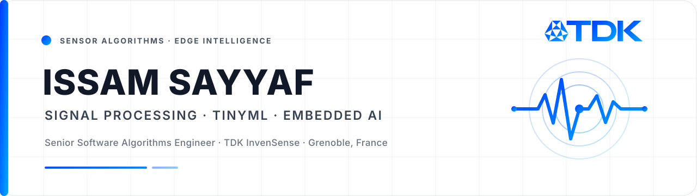

<div align="center">
  
</div>

<br />

<div align="center">
  <strong>I turn real-world sensor signals into reliable intelligence that runs on the edge.</strong>
</div>

<div align="center">
  <sub>Senior Software Algorithms Engineer @ TDK InvenSense · Grenoble, France</sub>
</div>

<br />

<div align="center">
  
  
  
  
</div>

## About me

I am a sensor-algorithms engineer working where **signal processing, machine learning, and embedded systems** meet. I build DSP pipelines and compact learning models for time-series data, then optimize them to operate under strict memory, latency, and power budgets.

My background includes a PhD focused on **positioning and anomaly detection for sensor and radio signals**. Today, I work across the complete path from raw measurements to deployable on-device intelligence.

```text
physical signal  →  signal processing  →  machine learning  →  embedded intelligence
```

## Engineering focus

| Signal intelligence | Edge machine learning | Embedded execution |
| :--- | :--- | :--- |
| IMU and motion sensing | TinyML and time-series models | Memory-aware implementation |
| Microphone and acoustic DSP | Activity and context recognition | Low-latency streaming |
| Ultrasonic sensing | Anomaly and event detection | Power-conscious inference |
| Sensor fusion | Model compression and quantization | Production validation |

## What I care about

- Building algorithms that remain robust outside the laboratory
- Converting research ideas into testable, maintainable software
- Finding new intelligence in IMU, acoustic, and ultrasonic signals
- Designing for the real constraints of embedded products—not only benchmark accuracy

## Technical toolbox

<p>
  
  
  
  
  
  
  
  
</p>

## Current interests

I am especially interested in **context-aware sensing**, **sensor foundation models**, **multimodal edge AI**, and new applications that extract more value from sensors already present in everyday devices.

If you are working on TinyML, time-series learning, acoustic intelligence, or novel sensing applications, I am always glad to exchange ideas.

## Contribution pulse

<div align="center">
  <a href="https://github.com/IssamTDK?tab=overview">
    
  </a>
</div>

<div align="center">
  <sub>Engineering progress over vanity metrics—commits, experiments, reviews, and continuous improvement.</sub>
</div>

---

<div align="center">
  <a href="https://github.com/IssamTDK?tab=repositories"><strong>Explore my repositories</strong></a>
  &nbsp;·&nbsp;
  <a href="https://github.com/IssamTDK"><strong>Follow my work</strong></a>
</div>

<div align="center">
  <sub>Professional affiliation shown for identification only. Views and projects shared here are my own.</sub>
</div>
