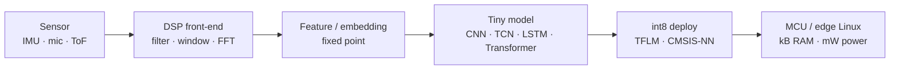

<h1 align="center">Issam Sayyaf</h1>

  <b>Edge AI &amp; Sensor Algorithms Engineer</b> · TDK InvenSense (Movea SAS), Grenoble 
  I turn raw sensor streams into models that run in kilobytes.

  
  
  
  
  
  
  
  

---

### What I work on

I design DSP front-ends and small deep learning models for time-series sensor data:
IMU, microphone, ultrasonic ToF, pressure, magnetometer. The models ship on MCUs
and embedded Linux, not on servers. Every design choice is a budget choice.

### Design rules I follow

- **Budget first.** Flash, RAM (tensor arena included), latency per window, and mA before architecture.
- **int8 by default.** Float is a debug mode, not a product.
- **Move work into the front-end.** A good feature is cheaper than four extra layers.
- **Measure on target.** Cycle counts on the device, not FLOPs on a slide.
- **Streaming, not batches.** Ring buffers, fixed windows, bounded worst-case time.

### Selected work

| Project | What it does | Footprint |
|---|---|---|
| [`repo-name`](#) | Anomaly detection for multi-sensor positioning (IMU / 5G / GNSS) | `— kB flash` · `— kB RAM` · `— ms/window` |
| [`repo-name`](#) | Real-time IMU activity / gesture pipeline on Cortex-M | `— kB flash` · `— kB RAM` · `— ms/window` |
| [`repo-name`](#) | Audio front-end and keyword model for MCU class devices | `— kB flash` · `— kB RAM` · `— ms/window` |
| [`repo-name`](#) | Yocto BSP with secure boot (TF-A, OP-TEE, dm-verity) and SWUpdate OTA | — |

Numbers are measured on target, not estimated.

### Research

- **PhD**, Université Gustave Eiffel — GEOLOC Lab, Nantes (2026).
  AI-based anomaly detection for resilient multi-sensor positioning.
- **MSc**, Università della Calabria — 110/110 cum laude.
- 10+ IEEE papers on sensor fusion, anomaly detection, and time-series deep learning.
  → [Google Scholar](#) · [ORCID](#)

### Now

- Sensor algorithms and edge AI at TDK InvenSense.
- Writing a unified, modality-independent framework for positioning anomaly detection.
- Reading and notes on TDK sensor families: SmartMotion IMU, SmartSound mic, SmartSonic ToF, Hall / TMR.

  <a href="#">LinkedIn</a> ·
  <a href="#">Scholar</a> ·
  <a href="mailto:you@example.com">Email</a>

